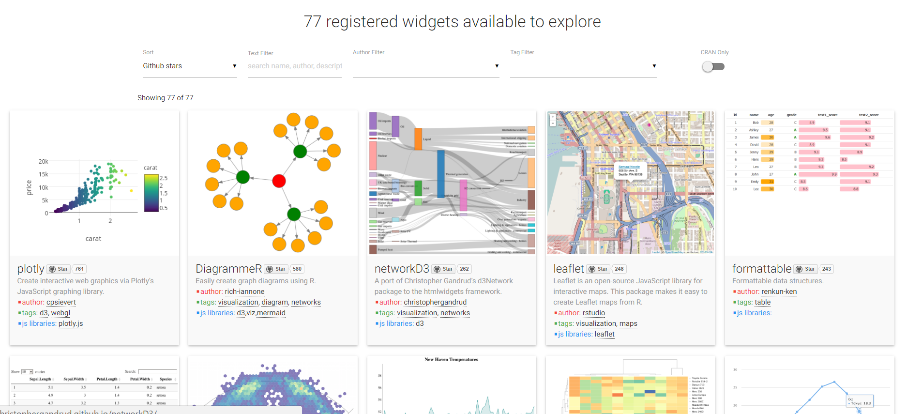

```{r setup, include=FALSE}
knitr::opts_chunk$set(echo = TRUE, warning=FALSE, message=FALSE)
```

# Will I Ever Use This Again?

## I do!

almost every day

## Companies

Twitter

Google

Microsoft

Uber

...


## Prominent Sightings

[New York Times](http://datastori.es/ds-56-amanda-cox-nyt/)

[FT](http://johnburnmurdoch.github.io/slides/r-ggplot/)

[Economist](https://twitter.com/benheubl/status/782547607830880256)

[FiveThirtyEight](https://channel9.msdn.com/Events/useR-international-R-User-conference/useR2016/FiveThirtyEights-data-journalism-workflow-with-R)


# From Static to Interactive

Interactivity improves 

- Exploration

- Storytelling and Communication

- Engagement

and is **becoming an expectation**.

## htmlwidgets

[htmlwidgets](http://htmlwidgets.org)

[gallery of htmlwidgets](http://gallery.htmlwidgets.org/)



## Examples

## Interactive ggplot2

[plotly](https://cpsievert.github.io/plotly_book/)

[ggiraph](http://davidgohel.github.io/ggiraph/introduction.html)

[ggiraph in print](http://www.swissinfo.ch/eng/migration-series_europe-s-immigration-balance-sheet/42495760)

## Some plotly code

```{r}
library(plotly)
ggplotly(
  ggplot(OrchardSprays, aes(x=treatment, y=decrease)) +
     geom_point(),
  width = 400, height = 300
)
```

## Some ggiraph code

```{r}
library(ggiraph)

ggp <- ggplot(OrchardSprays, aes(x=treatment, y=decrease)) +
     geom_point_interactive(aes(tooltip=decrease))
ggiraph(code = print(ggp), width=0.4)
```

## Same in scatterD3

```{r}
library(scatterD3)

scatterD3(
  x=rowpos, y=decrease, data=OrchardSprays,
  lasso=TRUE, width=400, height=300)
```

## a litte more biostats-y

[qtlcharts](http://kbroman.org/qtlcharts/)

```{r}
library(qtlcharts)
data(geneExpr)
ipc <- iplotCorr( geneExpr$expr, geneExpr$genotype, reorder=TRUE
   ,chartOpts=list( height = 400, width = 800 )
)
```

## qtlcharts iplotCorr

```{r}
ipc
```

## more qtlcharts

```{r echo = F}
library(qtlcharts)
# random growth curves, based on some data
times <- 1:16
n <- 100
start <- rnorm(n, 5.2, 0.8)
slope1to5 <- rnorm(n, 2.6, 0.5)
slope5to16 <- rnorm(n, 0.24 + 0.09*slope1to5, 0.195)
y <- matrix(ncol=16, nrow=n)
y[,1] <- start
for(j in 2:5)
    y[,j] <- y[,j-1] + slope1to5
for(j in 6:16)
    y[,j] <- y[,j-1] + slope5to16
y <- y + rnorm(prod(dim(y)), 0, 0.35)


iplotCurves(y, times, y[,c(1,5)], y[,c(5,16)],
  chartOpts=list(curves_xlab="Time", curves_ylab="Size",
     scat1_xlab="Size at T=1", scat1_ylab="Size at T=5",
     scat2_xlab="Size at T=5", scat2_ylab="Size at T=16"
  )
)

```

## pivot tables

```{r}
library(rpivotTable)

rpivotTable(OrchardSprays, height=400)
```

## parallel coordinates

```{r}
library(parcoords)
pc <- parcoords(
  OrchardSprays, brushMode="1d", reorderable=TRUE,
  rownames=FALSE, color=list(colorBy="treatment",colorScale=htmlwidgets::JS("d3.scale.category10()"))
)
```

```{r echo=FALSE}
htmltools::tags$div(
  style="text-align: left;",
  pc
)
```

## networkD3

```{r}
library(networkD3)
#thanks Evelina Gabasova
#http://evelinag.com/blog/2015/12-15-star-wars-social-network/#.V_zauvArI2y
network <- jsonlite::fromJSON(
  "https://cdn.rawgit.com/evelinag/StarWars-social-network/master/networks/starwars-full-interactions-allCharacters-merged.json"
)

fn <- forceNetwork(
  Links = network$links, Nodes = network$nodes,
  Source = "source", Target = "target", NodeID = "name",
  Value = "value", Nodesize = "value",
  Group = "colour", zoom = TRUE, linkDistance = 100, charge = -25
)
```

## Star Wars force

```{r}
fn
```

## 3d

`plotly`, `rthreejs`, and `rgl`

```{r echo=FALSE}
# example 3 chopper from python -------------------------------------------

library(geomorph)
plyFile <- 'http://people.sc.fsu.edu/~jburkardt/data/ply/chopper.ply'
dest <- basename(plyFile)
if (!file.exists(dest)) {
  download.file(plyFile, dest)
}
mesh <- read.ply(dest)
# see getS3method("shade3d", "mesh3d") for details on how to plot 

# plot point cloud
x <- mesh$vb["xpts",]
y <- mesh$vb["ypts",]
z <- mesh$vb["zpts",]
m <- matrix(c(x,y,z), ncol=3, dimnames=list(NULL,c("x","y","z")))

# now figure out the colormap
zmean <- apply(t(mesh$it),MARGIN=1,function(row){mean(m[row,3])})

library(scales)
facecolor = colour_ramp(
  brewer_pal(palette="RdBu")(9)
)(rescale(x=zmean))

plot_ly(
  x = x, y = y, z = z,
  i = mesh$it[1,]-1, j = mesh$it[2,]-1, k = mesh$it[3,]-1,
  facecolor = facecolor,
  type = "mesh3d"
)
```

## maps

```{r}
library(leaflet)


```

# HTML/CSS/JS in R

## Manual Hard Way

```{r eval=FALSE}
cat(
  '
<!DOCTYPE html>
<html>
<head>
<meta charset="utf-8"/>


</head>
<body style="background-color:white;">
<h1>HTML in R</h1>
</body>
</html>
  ',
  file="manual_html.html"
)
rstudioapi::viewer("manual_html.html")
```

## htmltools

```{r eval=FALSE}
library(htmltools)

browsable(tags$h1("HTML in R"))
```

> 100 available tags

[code](https://github.com/rstudio/htmltools/blob/master/R/tags.R#L714-L825)


## Rmarkdown/markdown

[rmarkdown](http://rmarkdown.rstudio.com/)

The previous example would look like this in `rmarkdown`.


> `# HTML in R`

This presentation built entirely in `rmarkdown`.


# Back and Forth

## Methods 

Shiny | R <-> HTML/CSS/JS

[crosstalk](https://github.com/rstudio/crosstalk) (experimental) | R -> HTML/CSS/JS <-> HTML/CSS/JS

?? - no agreed upon standard yet

